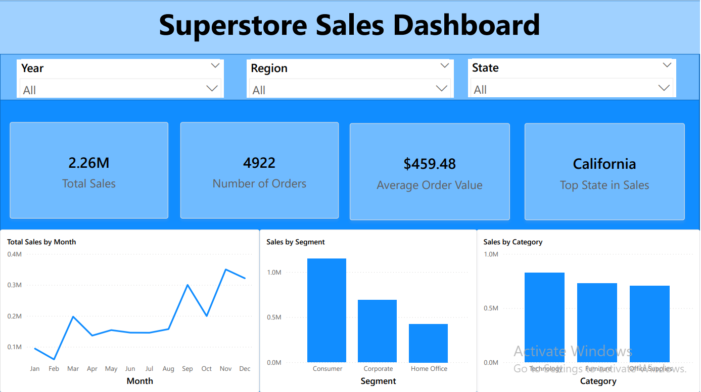

# Superstore Sales Analysis Dashboard

I have made a Power BI dashboard analyzing sales from the Superstore dataset. The dashboard highlights sales data across time, region, and category. The dataset is provided by kaggle and the link is provided below.

## Business Objective

To build a dashboard to understand Superstore’s sales performance, looking at key metrics such as: revenue trends over time, state sales, and identifying the top-performing categories of products.

## Dataset

- **Source:** [Superstore Sales Dataset](https://www.kaggle.com/datasets/vivek468/superstore-dataset-final)  
- **Key Fields:** Order date, sales, profit, category, sub-category, customer, state, country  

---

# Download the dashboard

Download the interactive dashboard (PBIX file) and open in Power BI desktop:

[Download Superstore PBIX](https://drive.google.com/file/d/1dZoRGZSJoCQt2fzbFY27aSEeiwTzevTc/view?usp=drive_link)

## Dashboard Preview

---

## Key Insights from the Dashboard

- Sales showed steady postive growth from the first year (2015) to (2018) 
- Consumers had the highest volume of sales, totalling $1.15M
- The top state in sales was California, totalling $446.31K
- Sales were largely concentrated in November and December, with a general upward trend in sales through the year, with the lowest monthly sales in Febuary of $59K across all regions and years, and the highest monthly sales in November totalling $350K

---
## Sections of the Report

- The report data can be sliced by Year, Region, and State to filter for particular data
- The report has cards showing Total Sales, Number of Orders, Average Order Value, and the Top state in sales
- There is a line chart demonstrating total sales by month, and a bar chart showing Sales by segment, and another bar chart showing Sales by cateogry.
- Report data can be sliced by Segments, Country and Year to show particular data.

---
## Skills applied
- Data cleaning and transformation: Handling null and invalid values, adjusting data types, removing duplicates
- EDA: Creating pivot tables and calculated fields
- Data visualization: Interactive dashboard made in power BI with slicers.
- Tools used: SQL, Excel, Power BI

